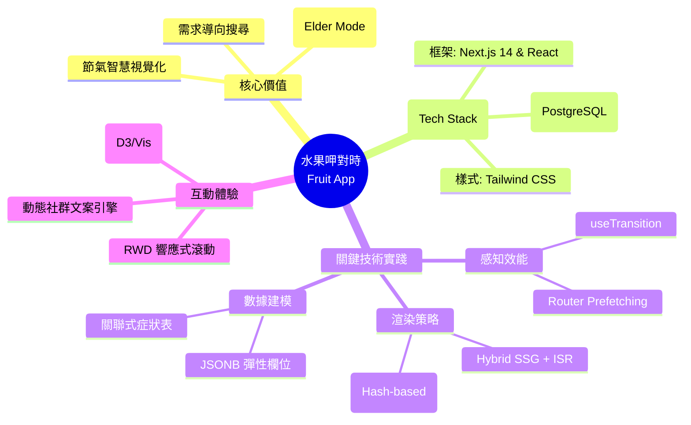

---

# 水果呷對時 (Fruit App) 🍎

> **「將節氣智慧視覺化，讓挑選水果從隨機運氣變為精準智慧。」**

## 📖 如何快速上手？

1.  **看大小**：選擇目前月份，優先尋找圖中**最大的圓圈** *(最對時)*。
2.  **看位置**：想吃甜點選右方 *(高糖)*，想養生則觀察座標軸標籤 *(寒 / 燥)*。
3.  **搜需求**：直接在搜尋框輸入你今天的身體狀況（如：`便秘`、`疲勞`），讓水果成為你的天然健康方案。
4.  **查指南**：進入「挑選指南」列表，透過「生活情調」或「身體訊號」交叉比對，快速獲得一份**系統化的採買建議清單**。

---

本專案是一個基於 `Next.js 14` 開發的現代化水果百科工具，旨在解決當代人對水果產季、屬性與營養價值的認知斷層。透過數據視覺化與情境導向設計，將複雜的食補智慧轉化為直覺的互動體驗，幫助使用者在繁雜資訊中精確鎖定最適時令的水果方案。

---

## 🌟 專案特色：直覺與知識的深度連結

### 1. 多維度數據映射 `Data-Driven Visualization`
首創**動態氣泡圖** `Interactive Bubble Chart`，將抽象的水果參數轉化為空間座標。
-   **時令加權**：氣泡大小動態反映該月份的盛產程度，直觀引導使用者進行產季選擇。
-   **屬性光譜**：提供「日常選品」、「甜蜜陷阱 (GI 值)」、「食養屬性」等六大模式切換，將糖度、熱量、寒燥等維度映射至座標象限，讓知識不再只是文字，而是 *可觸知的空間感*。

### 2. 情境優先導引 `Context-Aware Search`
重塑搜尋邏輯，不再侷限於「水果名稱」，而是以**「使用者需求」**為核心。
-   **需求索引**：支援以生理訊號（如：解熱、潤肺）或生活情境（如：運動後、禮贈）為關鍵字，即時過濾最適水果。
-   **智慧關聯**：詳細頁面根據營養成分與季節因子計算「相似推薦」，構建完整的水果知識鏈結。

### 3. 包容性設計：長輩模式 `Elder Mode`
針對視力退化族群進行深度 UI 適配，非單純縮放網頁，而是針對**字級**、**觸控熱區**與**層級對比**進行重構，確保資訊獲取的流暢度。

---

## 🏗 技術實踐：工程決策與細節處理

> 本專案在實作過程中，解決了多項現代 Web 開發中的挑戰，確保了系統的穩定性與 *流暢感*：

-   **感知效能優化** `Concurrent Features & Prefetching`
    為消除分頁載入的頓挫感，結合 React 的 `useTransition` 與 Next.js `router.prefetch` 策略。在使用者鎖定水果的瞬間即觸發預取邏輯，確保視聽回饋與導覽跳轉同步，達成 *無縫的 SPA 體驗*。

-   **決定性 UI 渲染** `Deterministic Jitter Algorithm`
    在泡泡圖中實作了基於「字串雜湊 `Hash-based`」的微位移演算法。相比隨機函數，此方案確保了同一個水果在不同渲染週期與端點 (`SSR`/`CSR`) 皆能落在相同的精確座標，徹底解決了 `Hydration Mismatch` 問題。

-   **混合渲染與快取策略** `Hybrid SSG/ISR`
    核心頁面採用 `SSG` 搭配 `generateStaticParams` 預先生成，並應用 `ISR` 進行定期更新。這讓網站能以 *靜態檔案的速度* 提供服務，同時維持資料的動態擴展性。

-   **層次化數據建模** `Relational Data Model`
    利用 `Supabase (PostgreSQL)` 構建強型別資料結構。針對 `JSONB` 彈性欄位與關聯式症狀表進行建模，支援高效的交叉過濾邏輯，實現了複雜的食療數據檢索引擎。

-   **無障礙佈局工程** `Context-Aware Layout`
    透過自定義的 CSS 變數系統與 Tailwind 響應式策略，實作了「抗縮放標籤 `ignore-scaling`」與「動態黏著標題 `Sticky Headers`」。針對桌面版與行動版設計了完全不同的視窗滾動邏輯，確保在不同載體下皆具備 *細膩的排版體感*。

-   **動態社群文案引擎** `Smart Copywriting Engine`
    實作了基於「產季權重」與「內容屬性」的動態分享機制。系統會自動判斷水果的當季程度與特色亮點，即時生成幽默且具傳播力的社群文案（如：盛產期的高情緒標題或功效導向的深度說明），並整合 `Web Share API` 提升社群互動深度。

-   **環境永續維運** `Zero-Cost Maintenance`
    透過優化的全域快取控制，將 API 呼叫次數降至極低。在 *零預算的雲端運算* 前提下，仍能支撐高頻次的數據查詢與使用者互動。

---

*Made with ❤️ by Mike. 將大自然的節奏，裝進你的手機裡。*
